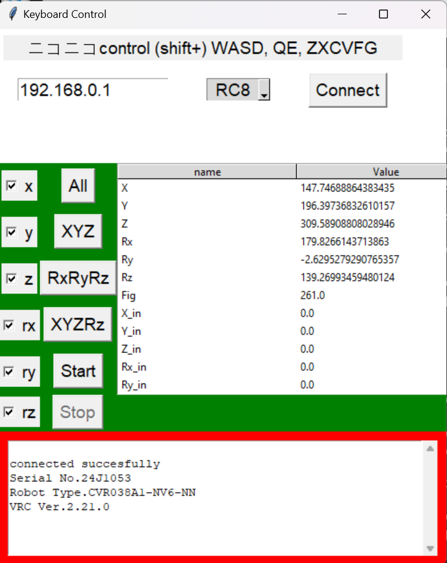

# Cobotta-Keyboard-Drive
This repository is for displaying a Python implementation for keyboard controls with the Denso Cobotta robot.

The robot can be controlled via the keyboard while pressing down SHIFT:
"W": +X, "S": -X, 
"A": +Y, "D": -Y, 
"Q": +Z, "E": -Z,
"Z": +Rx, "X": -Rx, 
"C": +Ry, "V": -Ry, 
"F": +Rz, "G": -Rz.

The graphical UI can be used to limit allowed axis, start and stop communication with the robot. To run this program, execute the main.py.

This version is using the pyrobot class provided by Shohei Kobata:
https://github.com/ShoheiKobata/orin_bcap_python_samples/tree/master/3DMouse_Controll

Bcap communication library:
https://github.com/DENSORobot/orin_bcap
